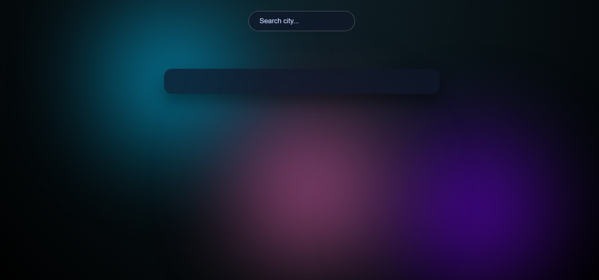
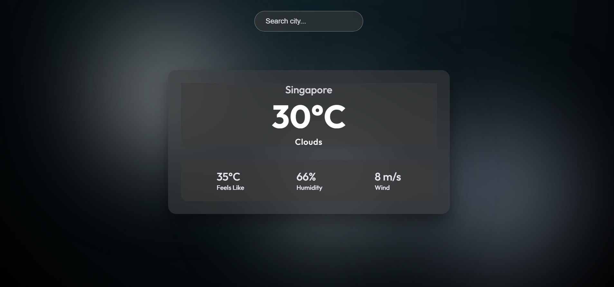
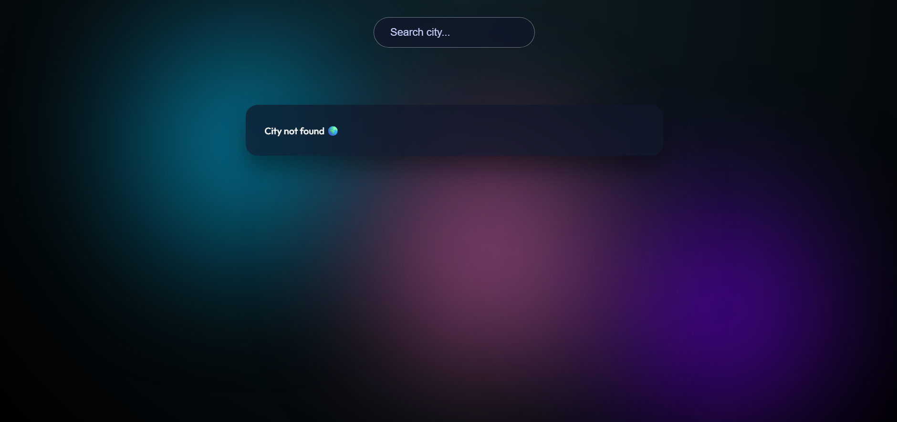

# 🌦️ React Weather App (Accessible & UX-Focused)

A modern and accessible Weather application built with React.  
This project goes beyond basic API integration and focuses on **accessibility (WCAG 2.2 AA)**, **keyboard & screen-reader usability**, and **clean, real-world UX patterns**.

---

## ✨ Features

- Search real-time weather by city name
- Fetches live data from the OpenWeatherMap API
- Dynamic theme switching based on weather conditions:
  - Sunny
  - Cloudy
  - Rainy
  - Snowy
  - Storm
  - Night (default)
- Animated background visuals
- Loading and error handling states
- Fully responsive layout across screen sizes

---

## ♿ Accessibility Highlights

Accessibility was treated as a **core requirement**, not an afterthought.

- Semantic HTML landmarks (`nav`, `main`)
- Skip to main content link for keyboard users
- Screen-reader–only labels for form inputs
- Keyboard-accessible interactions (no mouse dependency)
- Live regions for loading and error feedback
- Visible focus indicators
- WCAG 2.2 AA color contrast compliance
- Tested using:
  - axe DevTools
  - Keyboard-only navigation
  - Manual screen-reader verification

---

## 🎨 UX & UI Decisions

- Glassmorphism-style weather card for content focus
- Animated gradient orbs for visual depth
- Weather-based theme tokens instead of hardcoded colors
- Clear visual hierarchy for weather information
- Clean typography and spacing for readability
- Animations kept subtle to avoid accessibility issues

---

## 🛠 Tech Stack

- React (Functional Components & Hooks)
- Axios (API requests)
- OpenWeatherMap API
- Custom CSS (no UI libraries)
- axe DevTools (Accessibility testing)

---

## 📸 Screenshots

### Default Weather Theme


### Sunny Weather Theme


### Cloudy Weather Theme


### Error State


---

## ▶️ Run Locally

Clone the repository:

```bash
git clone https://github.com/MamathaBaiS/accessible-weather-app.git
```

Navigate to the project folder:

```bash
cd accessible-weather-app
```

Install dependencies:

```bash
npm install
```

Replace your current `.env` section with this:

```bash

```md
Create a `.env` file in the project root and add your **own OpenWeatherMap API key**:

```env
REACT_APP_WEATHER_API_KEY=your_api_key_here

```
Start the development server:

```bash
npm start
```

The app will be available at `http://localhost:3000`.